<p align="center">
  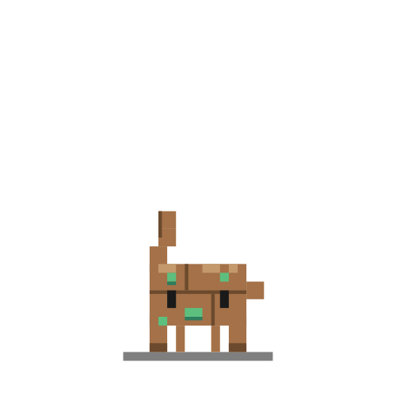
</p>
<h1 align="center">Rocky on Desk</h1>
<p align="center">
  <a href="README.zh-CN.md">中文版</a>
</p>
<p align="center">
  <sub>A pixel-art desktop pet based on <b>Rocky</b> from <i>Project Hail Mary</i> by Andy Weir.<br>Built on the <a href="https://github.com/rullerzhou-afk/clawd-on-desk">clawd-on-desk</a> framework.</sub>
</p>

<p align="center">
  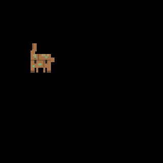
</p>

Rocky lives on your desktop and reacts to what your AI coding agent is doing — in real time. As an Eridian engineer, he watches your cursor with sonar sensors, taps his legs while thinking, and celebrates when tasks complete.

> Built on **[clawd-on-desk](https://github.com/rullerzhou-afk/clawd-on-desk)**, an open-source Electron desktop pet framework. Rocky is a custom theme — all credit for the engine goes to the clawd-on-desk authors and contributors.

## Rocky — The Eridian Engineer

- **Spherical rock body** with textured stone plates and warm glowing crystals
- **Five articulated spider legs** that type, juggle, sweep, and wave
- **Golden sonar sensor crystals** that track your cursor instead of eyes
- **Full sleep sequence** — yawn, doze, collapse, sleep, and startled wake-up
- **Click reactions** — drag to dangle, double-click to flail

## Animations

<table>
  <tr>
    <td align="center"><br><sub>Idle</sub></td>
    <td align="center"><br><sub>Idle Look</sub></td>
    <td align="center"><br><sub>Yawn</sub></td>
    <td align="center">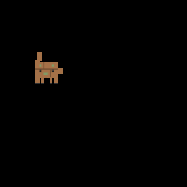<br><sub>Doze</sub></td>
    <td align="center">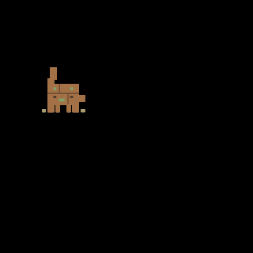<br><sub>Collapse</sub></td>
    <td align="center">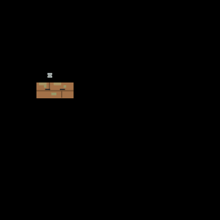<br><sub>Sleeping</sub></td>
  </tr>
  <tr>
    <td align="center">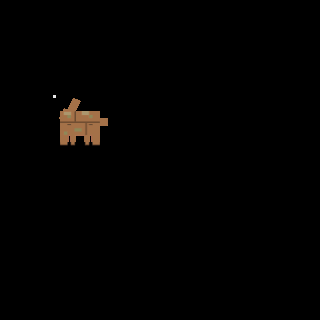<br><sub>Wake</sub></td>
    <td align="center">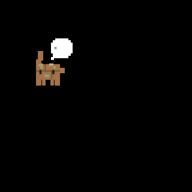<br><sub>Thinking</sub></td>
    <td align="center">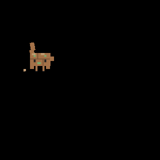<br><sub>Typing</sub></td>
    <td align="center">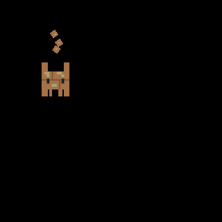<br><sub>Juggling</sub></td>
    <td align="center">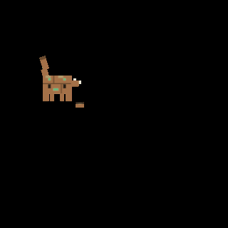<br><sub>Building</sub></td>
    <td align="center">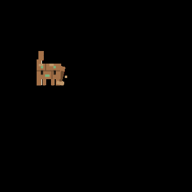<br><sub>Sweeping</sub></td>
  </tr>
  <tr>
    <td align="center">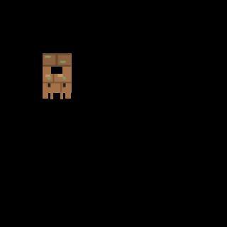<br><sub>Carrying</sub></td>
    <td align="center">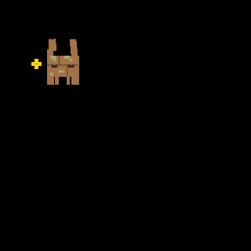<br><sub>Happy</sub></td>
    <td align="center">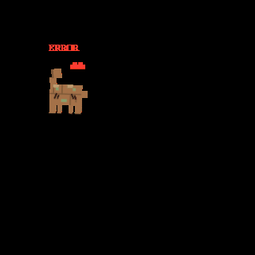<br><sub>Error</sub></td>
    <td align="center">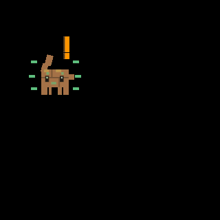<br><sub>Notification</sub></td>
    <td align="center">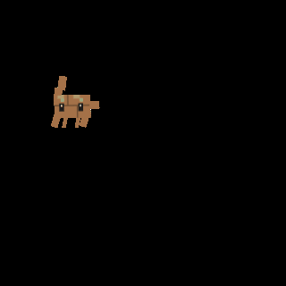<br><sub>Drag</sub></td>
    <td align="center">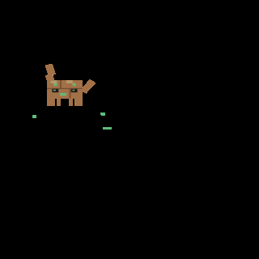<br><sub>Double Click</sub></td>
  </tr>
</table>

## Theme Capabilities

| Capability | Status |
|---|---|
| Eye/Cursor Tracking | Sonar sensor crystals track cursor |
| Full Sleep Sequence | Yawn → Doze → Collapse → Sleep → Wake |
| Working Tiers | Typing (1) → Juggling (2+) → Building (3+) |
| Reactions | Drag dangle, double-click flail |
| Idle Animations | Follow cursor + random look-around |
| Mini Mode | Not yet |

## Quick Start

### Download & Run

Download the latest release from **[Releases](https://github.com/YingYveltal/rocky-on-desk/releases)** and launch. Then set your theme to "Rocky" in Settings → Theme.

### Run from Source

```bash
git clone https://github.com/YingYveltal/rocky-on-desk.git
cd rocky-on-desk
npm install
npm start
```

## Acknowledgments

This project is a **custom theme** built on top of the excellent **[clawd-on-desk](https://github.com/rullerzhou-afk/clawd-on-desk)** framework.

- **clawd-on-desk** — the Electron desktop pet engine, created and maintained by [@rullerzhou-afk](https://github.com/rullerzhou-afk) (鹿鹿) and [contributors](https://github.com/rullerzhou-afk/clawd-on-desk#contributors). Licensed under AGPL-3.0.
- **Rocky theme** — pixel art and character design by [@YingYveltal](https://github.com/YingYveltal). Rocky is a character from *Project Hail Mary* by Andy Weir. This is an unofficial fan work.
- **Project Hail Mary** — the novel by Andy Weir that introduced Rocky, the Eridian engineer who captured readers' hearts.

## License

- **Source code** (engine, scripts, hooks): [AGPL-3.0](LICENSE), inherited from clawd-on-desk.
- **Rocky theme assets** (`themes/rocky/assets/`): Copyright [@YingYveltal](https://github.com/YingYveltal). All rights reserved.
- **Other theme assets** (`themes/calico/`, `themes/clawd/`, `themes/cloudling/`, `assets/`): Copyright their respective owners. All rights reserved. See [assets/LICENSE](assets/LICENSE).
